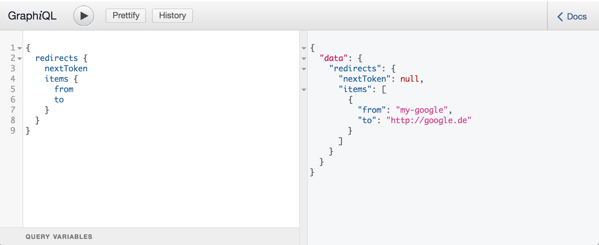
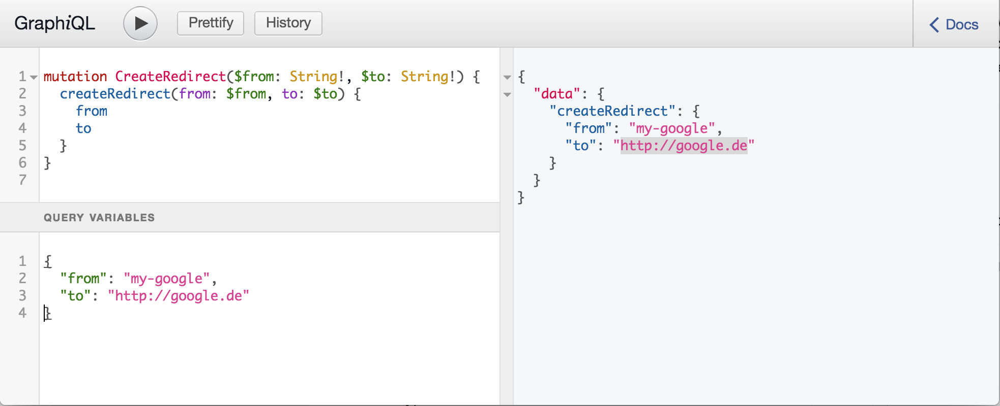

# serverless-url-shortener

A starter kit for an url shortener service.
Its **serverless**, **DBless** and has a nice **GraphQL API** :)

## How it works

Empty files with a specific S3 website hosting header are used as redirect markers. A Cloudfront distribution sits in front of the S3 bucket which can be used to setup a **custom domain** (like goo.gl) for your short urls.

A small GraphQL API lets you create and list redirects.  
 

## How to use

Make sure you have valid AWS credentials in your environment and then run:

`$ yarn deploy`

This will output the endpoint for your GraphQL API (something like https://\<id\>.execute-api.\<region\>.amazonaws.com/dev/graphql).
This stack deploys a Cloudfront distribution with an url like \<id\>.cloudfront.net. After you created a redirect you can use this url to test the redirection. In the example above this would be `http://<id>.cloudfront.net/my-google`

## Gotchas

* no tracking (but you can use cloudfront logs to analyze your requests)
* no A/B testing
* no segmentation
